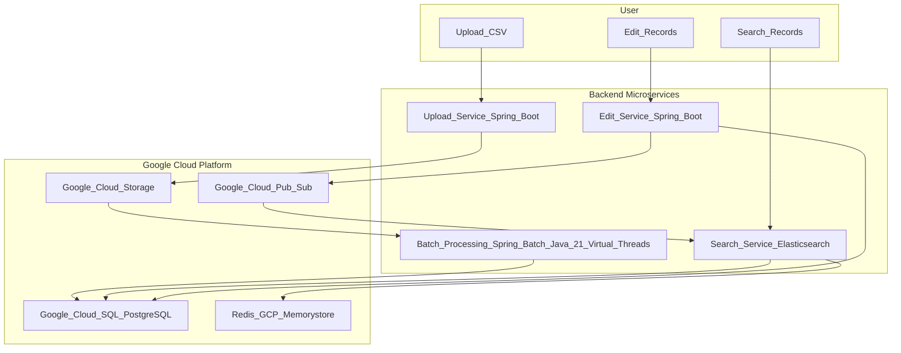
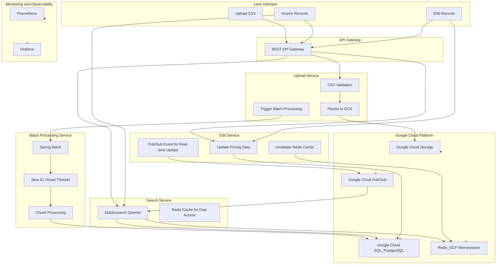

# TA-Java CaseStudy

## Personal Information

- **Name**: Siddharth Reddy, Lucky
- **Email**: siddharth.luckyreddy@gmail.com
- **Current Role**: Sr. Software Developer, Ford Motors
- **Number of Years/Months in the role**: 7+ years
- **Current Responsibilities**: Experienced Microservices Developer with 7 years of expertise in building and optimizing scalable, distributed systems using Java. Proficient in Spring Boot, Spring Cloud, and API design, with a strong focus on cloud-native solutions, containerization, and high-performance backend architectures.

## Technical Competencies
### Front-end Technologies: 
Angular, React TS 

### Back-end Technologies: 
* SpringBoot: Microservices and expose REST APIs, GraalVM.
* Quarkus: Container-friendly, Small image footprint and access to ORMs like Panache. 
* Spring WebFlux: Non-blocking, reactive, scalable.
* Virtual Threads: Out-of-the-box feature for concurrency management in Java 21.
* Java 21: Records for immutability, superior garbage collection, virtual threads, String templates.

### Databases: 
* GCS: For cloud storage of CSV files, trigger backend services on upload.
* Spring batch: For parsing and processing large CSV files, batch jobs can be utilized to handle the ingestion of pricing data. This can be combined with Spring Boot to ensure efficient processing.
* Google Cloud SQL: PostgreSQL for storing Store ID, SKU, Product Name, Price, and Date.
* ORM: Spring Data JPA to handle CRUD operations.

### Seach and Edit: 
* Search Service: A RESTful service for searching and retrieving records.
* Elastic Search: Advanced searching, Filtering by multiple parameters.
* Spring Data Elasticsearch: Spring integration for connecting to Elasticsearch.

### Caching
* Redis or GCP Memory Store:  For faster access to frequently requested data.
* Expiration: Setting TTL to manage the gathering of stale data.

### Queuing:
Pub Sub or Kafka.

### Cloud Platforms: 
AWS, GCP, Terraform for infrastructure setup.

---

## Functional Requirements:
#### 1. Upload and persist pricing feeds from retail stores using CSV:
##### CSV Upload Service:
* Users will upload CSV files via a dedicated API endpoint.
* The CSV files will include fields like Store ID, SKU, Product Name, Price, and Date.
* Use Google Cloud Storage (GCS) to store these uploaded files.
* Implement Spring Batch to process and validate these CSV files in batches, ensuring scalability when dealing with large datasets.
* Virtual threads from Java 21 will be utilized during batch processing to handle multiple records concurrently without causing performance bottlenecks.
* The processed data will be persisted in Google Cloud SQL (PostgreSQL) using Spring Data JPA for database interaction and ORM.

#### 2. Search and Pricing Records:
##### Search Service:
* Users can search for pricing records based on criteria like Store ID, SKU, Product Name, or Date.
* A dedicated search microservice will be developed using Spring Boot.
* For fast and flexible searching, implement Elasticsearch to index and query the pricing data.
* Spring Data Elasticsearch can be used to integrate with Elasticsearch and enable full-text searching capabilities.

#### 3. Save and Edit changes to Record:
##### Edit / Update Service:
* Users will be able to edit specific pricing records via a REST API.
* The API will accept changes to pricing records, and these changes will be persisted back into the Google Cloud SQL database.
* Optimistic Locking will be implemented using Spring Data JPA to avoid data inconsistencies during concurrent edits.
* The cache will be updated accordingly using Redis to reflect the latest changes in the pricing data.
* Optionally, use Google Cloud Pub/Sub to trigger events when records are updated, ensuring the system can scale to multiple microservices.

## Non Functional Requirements:
#### 1. Performance and Scalability:
* Spring Boot Microservices: Modular microservices architecture for scalability.
* Java 21 Virtual Threads: Out-of-the-box concurrency during I/O-bound tasks such as file uploads, database queries, and API calls.
* Google Kubernetes Engine (GKE): The microservices will be containerized and deployed on GKE, auto-scaling for loads from a retail chain with 3,000 stores.
* Caching:
  * Redis (GCP Memorystore) Cache frequently accessed pricing data and search results, reducing the load on both the database and Elasticsearch.
  * Cache Expiration: A time-to-live (TTL) mechanism for handling stale records.

#### 2. Availability and Fault Tolerance
* Google Cloud SQL: PostgreSQL service for database durability and uptime.
* Retry Mechanism: Spring Retry for handling transient failures in critical services such as file uploads, database writes, or external API calls.
* Message-driven Architecture: Google Cloud Pub/Sub, implements asynchronous communication, fault-tolerant and decoupled.

#### 3. Security:
* Spring Security: for role-based access to APIs for only particular users to access particular APIs
* OAuth 2.0: For external services to provide access grants and auth users.
* Data Encryption: Strategies to encrypt data at Google Cloud SQL, Cloud Storage, use SSL/TLS for transport.
* Keycloak: For granting and maintaining role-based information, maintain organizational structure for granular organization.

#### 4. Monitoring Observavability
Spring Actuator, Prometheus - for cloud-native monitoring, Grafana.

#### 5. Compliance
GDPR compliance - consent for data processing, Timely backups for cloud SQL.

---
### Context Diagram: 

---
### Solution Architechture:

---
### Design Descision:
* Spring Boot for Microservices: Modular, scalable microservices that handle different functionalities like upload, search, and edit.
* Java 21 Virtual Threads: Used to optimize concurrency and handle high numbers of concurrent requests efficiently, especially for I/O-heavy operations like file uploads and database interactions.
* Spring Batch for CSV Processing: Spring Batch processes large CSV files in chunks, ensuring efficient resource management and handling high volumes of data.
* Google Cloud Storage (GCS): Selected for persisting uploaded CSV files due to its durability, scalability, and seamless integration with other GCP services.
* Google Cloud SQL (PostgreSQL): Chosen for storing processed pricing data, offering managed relational database services with built-in high availability, scaling, and ACID compliance for data integrity.
* Elasticsearch for Search: Implemented to enable fast, full-text search on large datasets, allowing users to search pricing records with flexible criteria.
* Redis (GCP Memorystore): Used as a caching layer to store frequently queried search results and pricing records, reducing database load and improving response times.
* Google Cloud Pub/Sub: Event-driven architecture that triggers real-time updates (e.g., after edits) and ensures loose coupling between microservices, making the system more scalable and maintainable.
* API Gateway: Centralized entry point for routing requests to the appropriate microservices, simplifying communication, and enforcing consistent security policies.
* Spring Security with OAuth 2.0 or Keycloak: Secured API endpoints with role-based access control, using OAuth 2.0 via Google Identity Platform for authentication and authorization.
* Retry Mechanism with Spring Retry: Implemented fault-tolerance to handle transient failures, ensuring reliability in critical operations like file uploads, database transactions, or service-to-service communication.
* Monitoring with Prometheus, Grafana, and Stackdriver: Chosen for system observability, real-time metrics collection, and alerting to ensure the system is monitored for performance, fault tolerance, and reliability.
* Auto-scaling with Google Kubernetes Engine (GKE): Microservices are containerized and deployed on GKE, allowing the system to scale up or down automatically based on load, ensuring resilience and resource optimization.
* Cache Invalidation: Ensured that the cache is invalidated after data updates to prevent serving stale data, particularly important for edit operations involving Redis and the search service.

---
